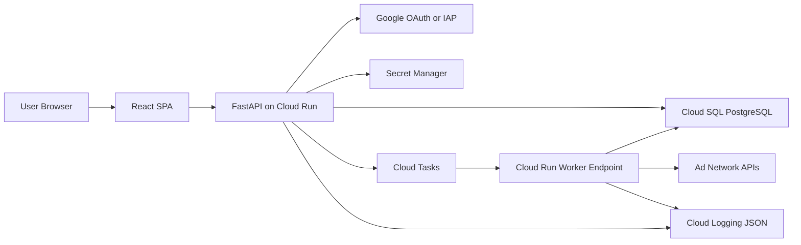
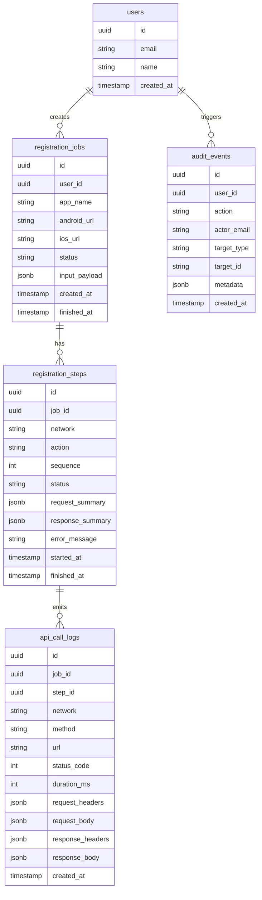
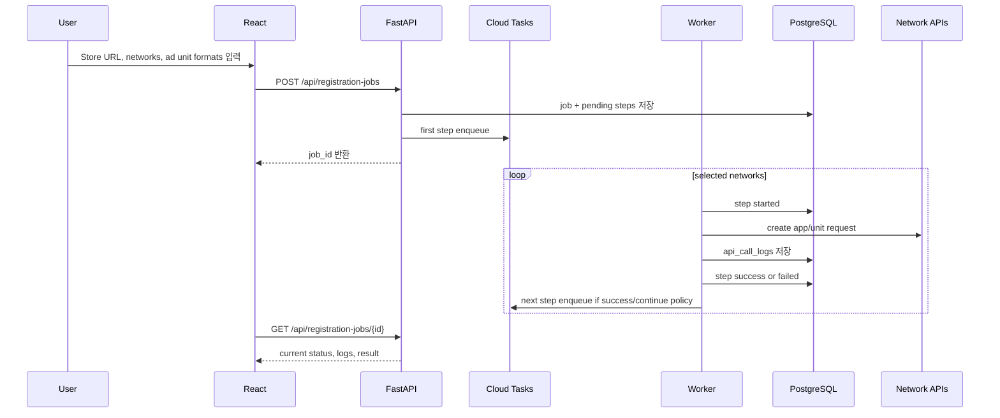

# Ad Network Hub Cloud Run / React 전환 계획

작성일: 2026-05-14  
목표: Streamlit 기반 운영 도구를 Cloud Run 친화적인 Python Backend + React Frontend 구조로 전환하고, 멀티 네트워크 순차 등록, API 요청/응답 로그, 사용자 감사 로그를 제품 기능으로 만든다.

## 1. 현재 코드 리서치 요약

현재 앱은 Streamlit 단일 프로세스 중심이다.

- 진입점: `app.py`, `pages/1_Create_App.py`, `pages/4_Update_Ad_Unit.py`
- UI 컴포넌트: `components/create_app_ui.py`, `components/create_unit_common.py`, `components/create_unit_applovin.py`, `components/create_unit_unity.py`
- 네트워크 설정/필드/페이로드 생성: `network_configs/*_config.py`
- 실제 API 호출: 대부분 `utils/network_manager.py`에 집중되어 있고, 일부만 `utils/network_apis/admob_api.py`, `utils/network_apis/ironsource_api.py`로 분리됨
- 상태 저장: `utils/session_manager.py`가 `st.session_state`에 앱/유닛 생성 이력, 캐시, 에러를 저장함
- 인증: `utils/auth.py`가 Streamlit 세션, JWT 쿠키, `admob_token.json` 파일을 조합해서 Google OAuth를 처리함

주요 문제는 Streamlit 세션 상태에 비즈니스 플로우가 강하게 묶여 있어 Cloud Run의 stateless 실행 모델, 감사 로그, 재시도 가능한 작업 큐, React UI와 자연스럽게 맞지 않는다는 점이다.

## 2. 외부 리서치 근거

- Cloud Run 서비스 컨테이너는 `0.0.0.0`과 `$PORT`에서 요청을 받아야 한다. 기본 포트는 8080이고, `PORT` 환경 변수가 주입된다.  
  참고: [Cloud Run container runtime contract](https://docs.cloud.google.com/run/docs/container-contract)
- Cloud Run 파일 시스템에 쓴 데이터는 인스턴스가 멈추면 지속되지 않으며 메모리를 사용한다. 따라서 `admob_token.json`, 세션 캐시, 감사 로그는 파일이 아니라 DB 또는 Secret Manager/Cloud Storage 등으로 옮겨야 한다.  
  참고: [Cloud Run container runtime contract](https://docs.cloud.google.com/run/docs/container-contract)
- Cloud Run은 stdout/stderr 로그를 Cloud Logging으로 수집한다. 단일 JSON 라인을 남기면 `jsonPayload`로 검색 가능한 구조화 로그가 된다.  
  참고: [Cloud Run logging](https://docs.cloud.google.com/run/docs/logging), [Cloud Logging structured logging](https://docs.cloud.google.com/logging/docs/structured-logging)
- FastAPI 공식 문서는 예전 `tiangolo/uvicorn-gunicorn-fastapi` 베이스 이미지를 더 이상 권장하지 않고, 자체 Dockerfile + Uvicorn/fastapi command 구성을 권장한다.  
  참고: [FastAPI in Containers](https://fastapi.tiangolo.com/fa/deployment/docker/)
- Vite는 `vite build`로 정적 배포 가능한 React 번들을 생성한다.  
  참고: [Vite production build](https://vite.dev/guide/build)

## 3. 권장 기술 선택

### Backend

권장: Python + FastAPI

이유:
- 기존 네트워크 API 연동, 페이로드 빌더, 카테고리 매핑 로직이 Python으로 이미 작성되어 있어 재사용 비용이 낮다.
- OpenAPI 문서가 자동 생성되어 React FE와 계약을 맞추기 쉽다.
- Cloud Run 컨테이너 배포와 잘 맞고, 동기 `requests` 기반 기존 코드를 점진적으로 `httpx` 또는 로깅 래퍼로 옮길 수 있다.

대안:
- Django: 관리자 화면과 ORM은 강하지만 현재 작업은 API 워크플로우/작업 큐 중심이라 FastAPI가 더 가볍다.
- Node/NestJS: React와 언어 통일은 가능하지만 기존 Python API 연동 자산을 버리게 된다.

### Frontend

권장: React + TypeScript + Vite

이유:
- 내부 운영 도구로서 SPA가 적합하고, 페이지 전환/작업 상태/로그 스트리밍 UI를 만들기 쉽다.
- Next.js SSR/SEO 이점이 거의 없고 Cloud Run 배포가 더 복잡해진다.
- Vite 빌드 결과를 FastAPI가 정적 파일로 서빙하거나 별도 Cloud Run/Nginx 컨테이너로 배포할 수 있다.

UI 라이브러리 추천:
- 1차: Tailwind CSS + Radix UI/shadcn 스타일 컴포넌트 + lucide-react 아이콘
- 이유: 운영 도구에 필요한 테이블, 탭, 드롭다운, 토스트, 다이얼로그를 빠르게 구성 가능

### Persistence

권장: Cloud SQL PostgreSQL

이유:
- "누가 언제 어떤 앱을 어떻게 등록했는지"를 관계형으로 조회하기 좋다.
- job, step, api call, audit event 간 관계를 명확히 저장할 수 있다.
- 추후 BigQuery 싱크를 붙여 운영 리포트를 만들기 쉽다.

Firestore 대안:
- 빠른 MVP에는 가능하지만, 감사 로그/작업 단계/검색 조건이 늘면 PostgreSQL이 더 예측 가능하다.

## 4. 목표 아키텍처



초기 배포는 단일 Cloud Run 서비스로 시작한다.

- FastAPI가 `/api/*`를 제공
- FastAPI가 React `dist/`를 정적 파일로 제공
- 인증 쿠키, CORS, 배포 도메인을 단순화

운영 트래픽과 작업량이 커지면 분리한다.

- `ad-network-hub-api`: FastAPI API
- `ad-network-hub-worker`: Cloud Tasks target
- `ad-network-hub-web`: 정적 FE 서빙 Cloud Run 또는 Cloud Storage + CDN

## 5. Backend 모듈 설계

```text
backend/
  app/
    main.py
    api/
      routes.py
      auth.py
      registrations.py
      networks.py
      audit.py
    core/
      config.py
      logging.py
      security.py
    db/
      session.py
      models.py
      migrations/
    services/
      network_registry.py
      registration_orchestrator.py
      audit_log.py
      http_client.py
      store_lookup.py
```

기존 코드 이동 전략:

- `network_configs/*`: 우선 그대로 재사용하고, Streamlit 의존이 없는 순수 페이로드 빌더로 유지
- `utils/network_manager.py`: 네트워크별 클라이언트 클래스로 분리
- `utils/app_store_helper.py`: Backend service로 이동
- `utils/session_manager.py`: 제거 대상. DB job/status/cache로 대체
- `utils/auth.py`: Streamlit 의존 제거. FastAPI OAuth/IAP 인증으로 대체

## 6. 데이터 모델 초안



마스킹 규칙:

- 항상 마스킹: `authorization`, `token`, `refresh_token`, `secret`, `secret_key`, `api_key`, `password`, `sign`, `security_key`
- 부분 마스킹: 앱 ID, 패키지명은 남겨도 되지만 OAuth token, bearer token, secret 계열은 저장하지 않는다.
- 원문 응답 전체가 필요한 경우에도 운영 DB에는 마스킹본만 저장하고, 민감 원문은 저장하지 않는다.

## 7. 멀티 네트워크 순차 등록 플로우

현재는 사용자가 네트워크를 선택하고 해당 네트워크별 단계로 이동한다. 목표는 한 화면에서 대상 네트워크를 선택하고, Backend가 순서대로 실행하는 구조다.



실행 정책:

- 기본 순서: AppLovin 조회/기준 확인 -> BigOAds -> IronSource -> Mintegral -> Pangle -> Fyber -> InMobi -> Unity -> Vungle -> AdMob
- 사용자가 순서를 편집할 수 있게 열어둔다.
- 실패 정책:
  - `stop_on_failure=true`: 한 네트워크 실패 시 이후 단계 중단
  - `continue_on_failure=true`: 실패 기록 후 다음 네트워크 계속
- 재실행:
  - failed step만 재시도
  - 성공 step은 idempotency key와 기존 생성 결과를 기준으로 중복 생성 방지

## 8. API 설계 초안

```text
GET  /healthz
GET  /api/me
GET  /api/networks
POST /api/store/lookup
POST /api/registration-jobs
GET  /api/registration-jobs
GET  /api/registration-jobs/{job_id}
POST /api/registration-jobs/{job_id}/retry
POST /api/registration-jobs/{job_id}/cancel
GET  /api/audit-events
GET  /api/api-call-logs?job_id=...
```

`POST /api/registration-jobs` 요청 예시:

```json
{
  "app_name": "My Game",
  "android_url": "https://play.google.com/store/apps/details?id=com.example.game",
  "ios_url": "https://apps.apple.com/app/id123456789",
  "app_match_name": "game",
  "networks": ["bigoads", "ironsource", "mintegral", "pangle"],
  "unit_formats": ["rv", "is", "bn"],
  "failure_policy": "continue_on_failure"
}
```

## 9. 샘플 UI 시각화

운영 도구이므로 마케팅 랜딩이 아니라 실제 작업 화면을 첫 화면으로 둔다.

### 화면 1: Registration Workbench

```text
+--------------------------------------------------------------------------------+
| Ad Network Hub                         [Search logs] [View audit] [User menu]   |
+----------------------+---------------------------------------------------------+
| Dashboard            | Register app across networks                             |
| Registration         |                                                         |
| Apps                 | Store links                                              |
| API Logs             | [ Google Play URL                              ]         |
| Audit                | [ App Store URL                                ]         |
| Settings             |                                                         |
|                      | App identity                                             |
|                      | [ App match name ] [ COPPA toggle ] [ Live in store ]    |
|                      |                                                         |
|                      | Networks                                                 |
|                      | [x] BigOAds  [x] IronSource  [x] Mintegral  [x] Pangle   |
|                      | [ ] Fyber    [ ] InMobi      [ ] Unity      [ ] AdMob    |
|                      |                                                         |
|                      | Execution                                                |
|                      | [ Continue on failure v ] [ Start registration ]         |
+----------------------+---------------------------------------------------------+
```

### 화면 2: 실행 중 Job 상태

```text
+--------------------------------------------------------------------------------+
| Job: My Game    Status: Running    Started by: user@company.com                 |
+--------------------------------------------------------------------------------+
| Step queue                                                                       |
| 1. BigOAds       success    app id 12345     units rv/is/bn created             |
| 2. IronSource    running    create app request sent                              |
| 3. Mintegral     pending                                                        |
| 4. Pangle        pending                                                        |
|                                                                                |
| Right panel                                                                     |
| - Current request summary                                                       |
| - Masked response body                                                          |
| - Retry failed step button                                                      |
+--------------------------------------------------------------------------------+
```

### 화면 3: API Logs

```text
+--------------------------------------------------------------------------------+
| API Logs       [Network v] [Status v] [Job id] [Date range]                     |
+--------------------------------------------------------------------------------+
| Time                User             Network      Method URL        Status  ms   |
| 2026-05-14 22:31    user@company.com BigOAds      POST   /app/add   200     812  |
| 2026-05-14 22:32    user@company.com IronSource   POST   /apps      201     664  |
+--------------------------------------------------------------------------------+
| Selected log detail                                                             |
| Request headers: masked                                                         |
| Request body: masked JSON                                                       |
| Response body: masked JSON                                                      |
+--------------------------------------------------------------------------------+
```

색/레이아웃 방향:

- 배경은 밝은 neutral, 텍스트는 고대비
- 네트워크 상태는 green/sienna/rose/blue를 기능 색으로 제한 사용
- 큰 히어로 대신 테이블, 진행 단계, 로그 패널 위주
- 버튼은 아이콘 + 짧은 명령형 라벨
- 카드 반경은 8px 이하, 중첩 카드 금지

## 10. 작업 순서

### Phase 0: 안전한 기반 추가

- `docs/cloud_run_react_migration_plan.md` 작성
- `backend/` FastAPI skeleton 추가
- `frontend/` React/Vite skeleton 추가
- 기존 Streamlit 앱은 그대로 유지

### Phase 1: Backend 추출

- `network_configs`를 Backend에서 직접 사용할 수 있게 import 정리
- `NetworkClient` 인터페이스 정의
- `utils/network_manager.py`에서 네트워크별 API 호출을 `backend/app/services/networks/*`로 분리
- 모든 외부 API 호출을 `LoggedSession` 또는 `httpx` wrapper를 통해 수행
- 요청/응답 로그를 JSON 구조화 로그와 DB `api_call_logs`에 동시 기록

### Phase 2: 등록 Job/Step 영속화

- Cloud SQL PostgreSQL 연결
- SQLAlchemy/Alembic 추가
- `registration_jobs`, `registration_steps`, `api_call_logs`, `audit_events` 테이블 생성
- Job 생성, 조회, retry, cancel API 구현
- Cloud Tasks 기반 worker endpoint 구현

### Phase 3: React 작업 화면 구현

- Registration Workbench
- Job detail timeline
- API Logs explorer
- Audit explorer
- Network credentials/status screen

### Phase 4: 인증/권한

- 내부 조직이면 IAP 우선 검토
- 외부/소규모 운영이면 Google OAuth + HttpOnly secure session cookie
- Backend는 모든 audit event에 `actor_email`, `actor_id`, `request_id`를 남김

### Phase 5: Cloud Run 배포

- 단일 서비스 Dockerfile: FastAPI + React build 정적 서빙
- Secret Manager로 네트워크별 credential 주입
- Cloud SQL connector 설정
- Cloud Logging 필드 기반 대시보드/알림 구성

## 11. 즉시 시작할 구현 범위

이번 첫 작업에서는 위험도가 낮은 기반만 추가한다.

- 기존 Streamlit 동작은 변경하지 않는다.
- FastAPI skeleton에 `/healthz`, `/api/networks`, `/api/registration-jobs`, `/api/audit-events`를 만든다.
- 구조화 JSON logging formatter와 외부 API 호출용 `LoggedSession` 초안을 만든다.
- React sample UI를 실제 첫 화면 컴포넌트로 만든다.

이후 두 번째 작업부터 기존 `create_app`/`create_unit` 호출을 Backend service로 하나씩 옮긴다.
